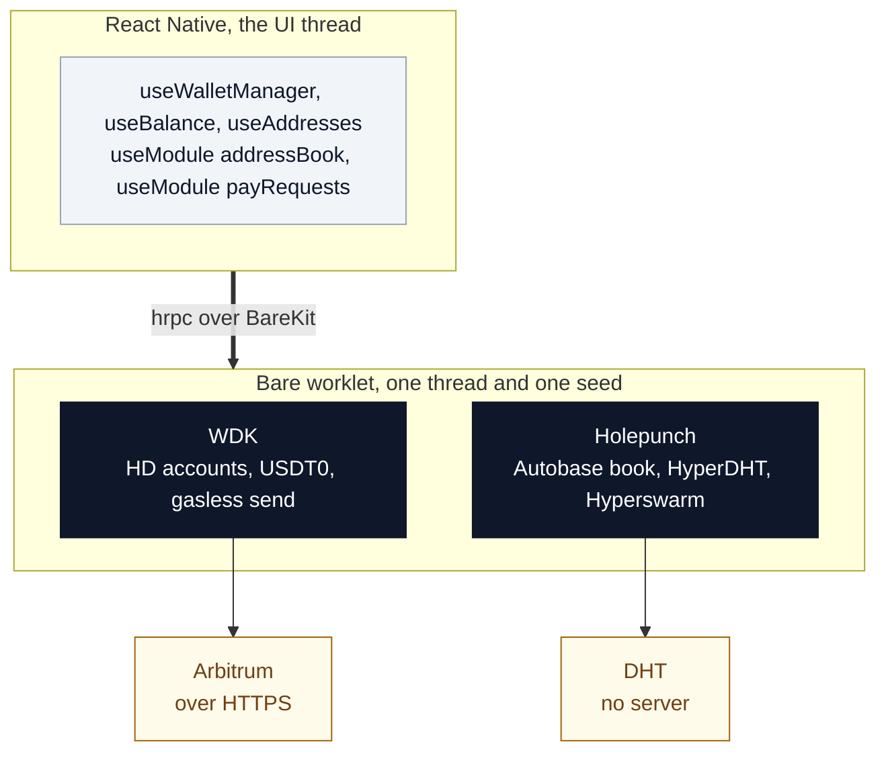

# How Moor works

The readable version of the design. [`SPEC.md`](SPEC.md) is the ground truth: milestones,
measured results, and the nineteen things the upstream documentation gets wrong. This page
is the explanation you would want before reading it.

If you only read one section, read [One secret, three identities](#one-secret-three-identities).
Everything else follows from it.

| | |
|---|---|
| [The shape in one picture](#the-shape-in-one-picture) | Two runtimes, one seed |
| [One secret, three identities](#one-secret-three-identities) | The whole trick |
| [The money half](#the-money-half) | USD₮ on Arbitrum, fees paid in USD₮ |
| [The everything-else half](#the-everything-else-half) | Contacts, with no server |
| [What Moor depends on](#what-moor-depends-on) | The blind peer, and the two honest others |
| [How two people meet](#how-two-people-meet-and-why-strangers-cannot-reach-you) | And why strangers cannot reach you |
| [Both stacks in one worklet](#both-stacks-in-one-worklet) | The undocumented key that made this possible |
| [Why React Native](#why-react-native-and-not-flutter) | A measured constraint, not a preference |
| [What breaks](#what-breaks-and-what-happens-when-it-does) | Every failure, and what survives it |
| [Where the proofs are](#where-the-proofs-are) | Ten scripts in `lab/` |

---

## The shape in one picture



Two technology stacks that have never been combined in public, running in **one** background
runtime, from **one** twelve-word recovery phrase.

The screens are ordinary React Native. Everything that touches the secret lives in the
worklet and is reached over a typed bridge. The seed crosses that bridge exactly once, at
unlock, and never comes back.

One thing the diagram invites you to get wrong: WDK is in the worklet because it needs a
real runtime for native crypto and key storage, **not because the money is peer-to-peer**.
It is not. Balances and sends travel over ordinary
HTTPS to an Arbitrum RPC endpoint. The peer-to-peer half is Holepunch. They share a worklet
because it is the only place either can run, and because sharing it is what lets them share
one seed in one thread.

---

## One secret, three identities

You write down twelve words. From the 64-byte seed those words produce, Moor derives three
independent identities, none of which can be used to find the others:

| Derived | By | Used for |
|---|---|---|
| `m/44'/60'/0'/0/0` | WDK, BIP-44 | Your Arbitrum account, where the money is |
| Autobase key | `deriveSeedKey(seed, { salt, info: namespace })` | Your contact list |
| Mooring keypair | `deriveSeedKeyPair(seed, { salt, info: 'moor:peer-identity' })` | Being reachable for payment requests |

```js
import { deriveSeedKeyPair } from '@tetherto/wdk-utils'
const mooring = deriveSeedKeyPair(seed, { salt: MOOR_SALT, info: 'moor:peer-identity' })
```

Same helper, different `info`, provably unrelated keys. Someone who learns your peer
identity learns nothing about your wallet address, and the reverse holds too.

Because all three are *derived* rather than *stored*, there is nothing extra to back up and
nothing extra to lose. Type the same twelve words into a new phone and you get the same
money, the same contacts, and the same reachability, with no account, no export file, and
no server that remembers you existed. That is also why there is no signup: there is nothing
to sign up to.

---

## The money half

USD₮0 on Arbitrum One, through WDK. The account is an ordinary EOA and the balance is read
from a public RPC endpoint. Nothing unusual, and deliberately so, because your money should
live somewhere boring and public.

**Fees are paid in USD₮, not ETH.** Arbitrum charges gas in ETH like every other chain.
What changes is who holds the ETH. A **paymaster** takes a small amount of USD₮ from you,
pays the ETH fee on your behalf, and you never learn what a gas token is.

This is **token mode, not sponsorship**. Nobody subsidises anybody. There is no account for
us to fund, no per-transaction bill, and therefore no business relationship that could be
withdrawn. You pay your own way, in the currency you already hold.

The mechanism is EIP-7702: your account temporarily delegates execution to a contract. That
contract's address is the most dangerous constant in the app, because whatever sits
there gets to act as your account. WDK requires it, ships no value for it, and tells you to
"verify this address independently" with no registry to verify against. So we verified it.
[`lab/t5`](lab/t5-delegation.js) fetches the runtime bytecode from Arbitrum, Ethereum and
Polygon and confirms all three are byte-identical. Re-run it before pointing this at real
money. The point is that you can, not that you should take our word.

**Self-paid gas remains a build option.** If every paymaster on earth refused you, you could
still move your money by paying ETH yourself (`MOOR_SELF_GAS=1`, which swaps the wallet
package at bundle time). A wallet whose only route to spending runs through one company's
API is not self-custodial in the way that matters.

> **Status.** This works, on chain, from the phone. Tapping a contact and sending 0.1 USD₮
> delivered exactly 0.1 and cost 0.0088 in fees, with the ETH balance unmoved at zero before
> and after. In Node, [`lab/t10`](lab/t10-send.js) does the same thing twice
> ([`0xad810dc2…`](https://arbiscan.io/tx/0xad810dc20ff55d2d5cbe3b6dff9475ba2af56cab2e1dada7e52d2e473e4221a8)).
>
> One thing is still broken and it is upstream. WDK prices a transfer before it signs the
> EIP-7702 authorization, so an account's **first** send is rejected with `AA20 account not
> deployed`. t10 gets past it by signing and broadcasting in two steps; the app cannot,
> because a signed user operation is full of BigInts and the worklet bridge turns those into
> strings. So sending from the app works for any account that has spent once, and not
> before. SPEC finding 16.

---

## The everything-else half

Here is the part that normally lives on a company's servers.

Your **contact list** is an [Autobase](https://github.com/holepunchto/autobase): an
append-only log with multiple writers, one per device, that converges without a coordinator.
It is created on your phone, encrypted with a key derived from your seed, and it never
touches a server that can read it.

Add a contact on your phone and it appears on your tablet. Add one on the tablet and it
appears on the phone. Both directions, no sync button, no conflict resolution to explain to
anyone, and, measured rather than assumed, about four seconds while both are open.

**Contacts are not a convenience feature.** Sending to a *person* you saved earlier, rather
than to a pasted 42-character string, retires an entire category of loss: transposed
characters, and clipboard-swapping malware that replaces an address between copy and paste.
That is the reason this half exists at all.

---

## What Moor depends on

Three dependencies. One we operate, two we do not.

### 1. The blind peer, which we run

Two devices can only exchange data directly if both are switched on. Phones are not switched
on. So Moor operates exactly one machine.

A **blind peer** is a left-luggage office. It accepts sealed boxes, keeps them available,
and hands them back on request. **It has no key.** It stores encrypted blocks whose contents
it cannot read, and holds nothing you do not already have on your own device.

- If it disappears, **you lose nothing**. Your data is on your devices. You lose the ability
  to sync to a device that is currently powered down.
- Anyone can run one. [`infra/blind-peer/`](infra/blind-peer/) is the script and the setup.
- Pointing at somebody else's is a config change, not a fork.

We run one because otherwise every person who clones this repo has to provision a server
before they can watch two devices sync. Holepunch runs peers for Keet, using Keet's keys, so
an app that wants this feature runs its own.

Ours is demo infrastructure: best-effort, no SLA, and it may be wiped. That is worth writing
down next to the key, because a mirror you cannot plan around is only half published.

### 2. An Arbitrum RPC endpoint, which we do not

Reading your balance means asking a node. Moor defaults to `arb1.arbitrum.io/rpc` and the
endpoint is a config value, so you can point at your own node. It never sees a key, and the
worst it can do is refuse to answer, which surfaces as "unavailable" rather than a zero.

### 3. A bundler and paymaster, which we do not

Paying fees in USD₮ routes the transaction through an ERC-4337 bundler and an ERC-7677
paymaster. These are two services, not one, and in Moor they are two providers: Pimlico's
public bundler submits the operation, Candide's public paymaster pays the ETH and takes
USD₮ for it. Both are keyless, and both are config values.

They are split because they had to be. Candide serves both roles from one URL, but its
public endpoint estimates EntryPoint v0.8 operations happily and then fails to submit them,
returning the EntryPoint's own bytecode as an error string — and v0.8 is what EIP-7702
requires. Pimlico's token paymaster wants an API key. One of each, and it works.

This is the dependency with real teeth, because a paymaster can decline you. The answer is
the self-gas build above: refuse Moor a paymaster and the wallet still spends, just in ETH.

**None of the three can read your contacts, and none can touch your keys.** That is the
claim worth making, and it is narrower than "no middlemen".

---

## How two people meet, and why strangers cannot reach you

Alice cannot look Bob up. **There is no directory in a system with no company in it**, and
any design claiming otherwise has smuggled a server back in. We state that as a property
rather than hiding it.

The gesture is a QR code exchanged once, the gesture every wallet already trains people to
make. After that they can reach each other forever, because both identities are derived from
their own recovery phrases and never expire.

The card is a URI, and it is deliberately small enough to read across a table:

```
moor://contact?a=0x742d35Cc…f44e&k=<64 hex>
```

The `a` is where to pay them. The `k` is the peer key, and it is the field no other wallet's
QR carries — the one that decides whether they can reach you at all. There is no name in it:
you name your own contacts, the way a phone does. 126 characters in total.

> **Two scans, one each way.** One scan can only ever introduce one direction. The
> alternative — a pairing window where you accept one inbound stranger for thirty seconds —
> would trade away the property the firewall exists for, so we didn't build it. The screen
> just makes the second scan obvious: save theirs, and it hands you straight back to your own
> code.

The peer identity is stored as `moor:<hex>` in `Contact.username`, a free-text field, because
the address book has no field for a peer key and its address-type enum is a closed,
runtime-enforced list of seven payment types (filed as
[address-book#6](https://github.com/tetherto/wdk-p2p-address-book/issues/6)). Because that is
the same address book Phase 3 syncs, **a person you scan on your phone appears on your tablet
with their peer key intact, and no code was written to make that happen.**

The codec lives in [`app/src/wdk/contactCard.mjs`](app/src/wdk/contactCard.mjs) and
[`lab/t11`](lab/t11-contact-card.js) imports it rather than reimplementing it, so the test
and the app cannot disagree about the format.

> **Status.** Half verified. The card renders on a phone, and the QR in that screenshot was
> read back by Apple's Vision framework — the same decoder a camera app uses — then parsed by
> `contactCard.mjs`, returning the right address and peer key at 126 characters. So
> generation, rendering and density are proven end to end. `t11` proves what happens after a
> scan: the contact write, the allowlist rebuild, the request that then arrives.
>
> **The camera capture path has not been run.** The iOS Simulator has no camera. Nobody has
> pointed a phone at another phone yet, so treat that one step as untested.

Then comes the part that makes it worth the trouble:

> **Your contact list is your firewall.**

Moor's peer server checks the connecting public key against your address book and refuses
anything it does not recognise, *before* the encrypted handshake completes. A stranger
cannot send you a payment request. Not filtered, not sent to a spam folder: **unroutable**.

Request-spam is the unsolved abuse channel on Venmo, Zelle and Cash App, all of which fight
it with moderation teams because their architecture lets any stranger address you.

Measured, not asserted: a peer that knows the recipient's public key — which is public, and
printed in QR codes — is refused, and adding them as a contact is what lets them through.
On a device, over the public internet, in about a second and a half.

---

## Both stacks in one worklet

WDK's bundler compiles the wallet packages into a single Bare worklet bundle. Its `modules:`
key, undocumented and the reason this project is possible, lets you compile *additional*
modules into the same runtime:

```js
// app/wdk.config.js
modules: {
  addressBook: { package: '@tetherto/wdk-p2p-address-book', factory: 'createWorkletModule', events: ['update'] },
  payRequests: { package: '@moor/pay-requests',             factory: 'createModule' }
}
```

`payRequests` is our own code, not a package call: about 300 lines in
[`app/modules/pay-requests/`](app/modules/pay-requests/), over half of them comments. It
gets the same seed the wallet gets, runs its own HyperDHT node in the same thread, and
reaches the UI through the same bridge.

Two details worth knowing before you write one:

- **Method calls are allowlisted.** `allowedModuleMethods` restricts what the UI may invoke
  on a module instance. Without it, the bridge can call anything on the object.
- **Delivery means acknowledged.** `request()` waits for the recipient's app to confirm, not
  for `socket.write()` to return. Measured on a real device: the phone accepted the
  connection and received *zero bytes*, because the sender closed the socket immediately
  after a "successful" write. Two layers reported success while nothing arrived.

---

## Why React Native, and not Flutter

A constraint rather than a preference, and one we measured.

WDK's bundler has two transports. `hrpc` targets React Native. `jsonrpc` targets Swift and
Kotlin, which is the only route a Flutter plugin could take. **`modules:` works on `hrpc`
and is silently dropped on `jsonrpc`**: configure it and the generated worklet simply has no
module wiring. No error, no warning. [`lab/t4`](lab/t4-bundle.js) demonstrates both halves.

Since `modules:` is how the address book gets into the worklet, a Flutter build would need a
hand-written worklet entry point, a JSON-RPC module bridge that does not exist, a BareKit
Flutter plugin, and a Dart reimplementation of WDK's state layer. That is *building WDK's
missing mobile infrastructure*, not demonstrating WDK.

React Native gives one codebase on both platforms, which was the actual requirement.

---

## What breaks, and what happens when it does

| If this fails | You lose | You keep |
|---|---|---|
| Our blind peer | Syncing to a device that is switched off | Every contact, on every device you have opened |
| Every paymaster | Gasless sends | Self-paid gas, as a build option |
| The recipient's phone is off | That payment request. It fails loudly, and says so | Everything else. Durable requests are Phase 5 |
| Arbitrum RPC | The balance reads "unavailable", **never a silent zero** | Your money, which was never here |
| Us | Nothing. There is no account, and no server holding anything | All of it |

That last row is the point of the whole project.

---

## Where the proofs are

Every architectural claim above was run before it was written down. The harness is
[`lab/`](lab/): ten scripts, each one testing an assumption rather than the app. Seven worth
pointing at directly:

| | |
|---|---|
| [`t2`](lab/t2-derive.js) | The contact list really is a pure function of the seed |
| [`t3`](lab/t3-converge.js) | Two devices converge, hermetically |
| [`t4`](lab/t4-bundle.js) | Both stacks bundle into one worklet, and why not Flutter |
| [`t5`](lab/t5-delegation.js) | The delegation contract is what it claims to be |
| [`t6`](lab/t6-public-mirror.js) | The same restore on the real internet, through a real mirror |
| [`t9`](lab/t9-pay-requests-public.js) | A payment request between two strangers, public DHT |
| [`t10`](lab/t10-send.js) | An account holding no ETH moves USD₮ and pays the fee in USD₮ |

[`lab/README.md`](lab/README.md) walks through all ten.

Three claims in these documents were wrong and were retracted rather than quietly edited,
all three because a hermetic test rig measured its own topology and we wrote the result down
as a property of the software. The cheap check that would have caught all three: before
believing any measurement, ask whether the rig could have produced it on its own.
