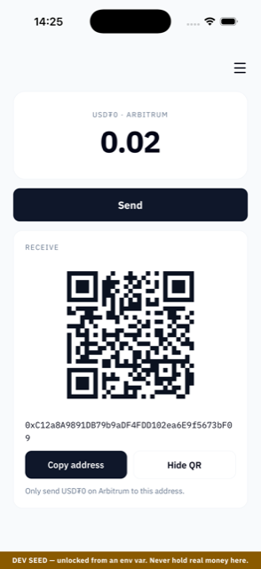
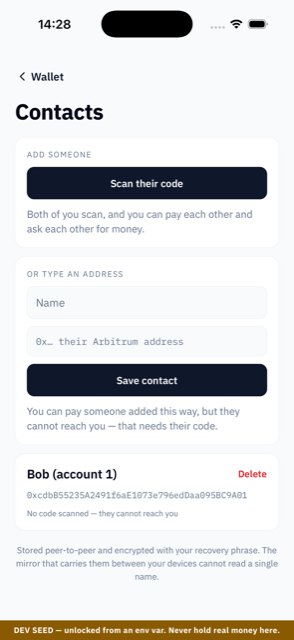
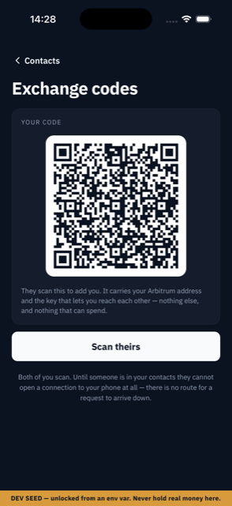
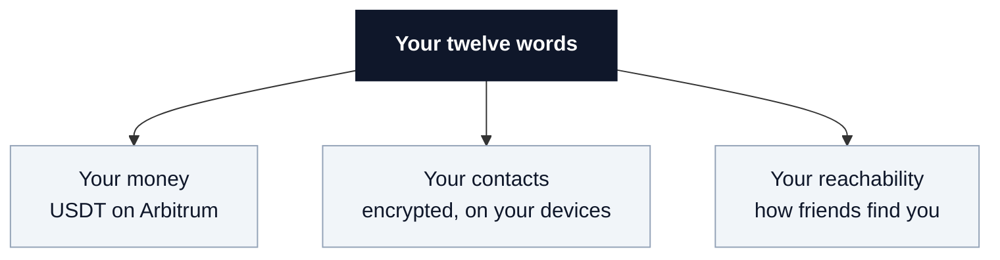
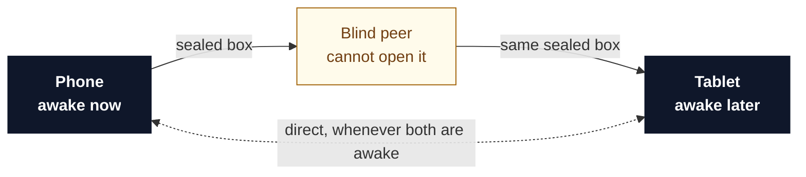

# Moor

**A dollar wallet with no account to be locked out of.**

There is no signup and no password. Your money, your contact list and your ability to be
reached all come from one twelve-word recovery phrase.


> Moor is a learning project and a reference app, not a product. It can hold real money on
> Arbitrum and comes with no warranty. It is not affiliated with or endorsed by Tether.

<p align="center">
  
  
  
</p>

<p align="center"><sub>
Running on an iPhone. The gold bar is the dev-seed warning: it appears on every screen of a
build unlocked from an environment variable. It doesn't appear in a release build.
</sub></p>

---

## In plain terms

Most crypto wallets kept the hard promise and quietly broke the easy one. Your money is
yours, but everything *around* your money still lives on somebody's server: the contact
list, the syncing between your devices, the requests to be paid. You signed up for an
account to get those things, and an account is something that can be closed.

Moor puts that half on your own devices too.

| The usual way | With Moor |
|---|---|
| Sign up with an email and a password | Nothing to sign up for. Your twelve words are the account |
| Paste a 42 character address and hope it is right | Tap a name in your contact list |
| Buy a second coin before you can move your dollars | Pay the fee in the same dollars you are sending |
| Your contact list sits on a company server | Your contact list sits on your phone and your tablet |
| Anyone who knows your address can ask you for money | People you have not added cannot reach you at all |
| A company can close your account | There is no account and no company |

In practice: you type twelve words into a new phone and everything comes back in a few
seconds. Not just the money. Your contacts and your ability to be reached come back too,
because all three are calculated from those same twelve words rather than stored somewhere
and fetched. There is nothing else to back up.



---

## The problem

Self custody solved one thing: your keys are yours, and the money sits on a public
blockchain rather than in a company's ledger. Then it left everything *around* the money —
your contact list, your devices staying in sync, requests to be paid — behind an account on
somebody's server. An account can be closed.

Pasting a **42 character string** is still the most common way people lose funds, through
transposed characters and clipboard-swapping malware. Needing a second asset before you can
move the dollars you already hold is still normal. Neither is a law of nature. Both are just
where the work stopped.

## What Moor does differently

**Your contacts live on your devices, not on a server.**
Add someone on your phone and they are on your tablet. No account, no sync button, no
company that has ever seen their name. The contact list is encrypted with a key derived
from your recovery phrase, so the mirror that carries it between your devices cannot read a
single character of it.

**You send to a person, not to a string.**
Choosing a name you saved earlier retires an entire category of loss, and that is what the
contact list is for. Syncing is the side effect.

**Fees are paid in dollars.**
Nobody holding savings in USD₮ should have to acquire a second asset just to move the
first. Moor pays the network fee in USD₮ itself, and not by subsidising you. There is no
sponsor, no funded account, and no bill that could stop being paid.

**Someone can ask you for money, with no server in the middle.**
Alice taps "request 25 USD₮". Bob's phone lights up. Nothing in between saw it happen.

**You become reachable by meeting someone, not by signing up.**
Like exchanging safety numbers in Signal, you scan each other's code once and can reach each
other forever. There is no directory to be listed in and nothing to look you up by — no
phone number, no username, no account.

**And a stranger cannot reach you at all.**
Your phone only accepts connections from people already in your contacts. An unsolicited
payment request is not filtered and does not land in a spam folder — there is no route for
it to travel down. Request spam is an unsolved problem on Venmo, Zelle and Cash App, all of
which fight it with moderation teams, because their design lets any stranger address you.

---

## Two caveats

### 1. We run one machine, and here it is

Two of your devices can only talk directly when both are switched on. Phones are not
switched on. So Moor operates a **blind peer**, which works like a left luggage office: it
accepts sealed boxes, keeps them available, and hands them back, without ever holding a
key.



Here it is:

```
a4z9rgfqbqcukuk33gd8z4cwcxijuoxm4eegc6po79rbxsiqpd1o
```

That key is the whole interface. It is already the default, so cloning this repo gives you
two-device sync with no configuration — and **it is not Moor-only**. Any app on
`blind-peering` or `wdk-p2p-address-book` can point at it with one line:

```bash
EXPO_PUBLIC_BLIND_PEERS=a4z9rgfqbqcukuk33gd8z4cwcxijuoxm4eegc6po79rbxsiqpd1o
```

Live since 2026-08-11. It is demo infrastructure with no SLA, and
[`infra/blind-peer/`](infra/blind-peer/) says exactly how little that promises — plus how to
run your own in three commands, and how to verify it with `lab/t6`.

If it vanishes tomorrow **you lose nothing**. Your data is already on your devices. What
you lose is the ability to sync to a device that happens to be powered off. The client takes
a *pool*, so adding your own key or replacing ours is a config change rather than a fork.

That is the only machine Moor operates, though it is not the only third party involved. The
money half talks to two more: a public Arbitrum RPC endpoint to read your balance, and a
bundler plus paymaster so you can pay fees in USD₮ instead of ETH. Both are swappable, and
neither can touch your keys or your contacts.

Moor also builds in a **self gas mode** where you pay the fee in ETH yourself, so if every
paymaster on earth refused you, your money still moves.

Everything else — contacts, payment requests, device sync — has no middleman at all.

### 2. USD₮ is issued by a company, and issuers can freeze

This one is about the asset, not about Moor. Tether operates a blocklist and has frozen
balances at specific addresses before. Holding your own keys means no company can move your
money or close your account, and that is real. It does not mean the issuer of a
centrally issued stablecoin has given up the ability to freeze it.

Moor removes the middlemen it can remove. It cannot remove that one.

---

## Where it actually is

| Feature | Status |
|---|---|
| Worklet running both stacks on a phone | iOS and Android |
| USD₮ balance on Arbitrum, live | works |
| Receive screen, with QR and copy | works |
| Fees paid in USD₮, no ETH needed | works |
| Contacts, peer to peer, synced across devices | works |
| Payment requests, laptop to phone | iOS |
| QR scan that introduces two people | the card renders and decodes; the camera half is unrun |
| **Sending USD₮, fee paid in USD₮** | **works — on chain, from the app, with no ETH** |
| Payment requests on Android | not yet |
| An account's *first* ever send | blocked upstream — SPEC finding 16 |

Contacts sync between an iPhone and an Android emulator given the same twelve words,
through a mirror that cannot read them. A laptop peer that had never met the phone asked it
for 25 USD₮ and the phone showed the request in about a second and a half.

Money moves, and it moves from the app. Tapping a contact and sending 0.1 USD₮ on the phone
delivered exactly 0.1 to the recipient and cost 0.0088 in fees, from an account holding
**zero wei of ETH** — before and after. [`lab/t10`](lab/t10-send.js) is the same path in
Node and re-runs against your own money
([`0xad810dc2…`](https://arbiscan.io/tx/0xad810dc20ff55d2d5cbe3b6dff9475ba2af56cab2e1dada7e52d2e473e4221a8)).

One caveat, and it is upstream: WDK prices a transfer before it signs the EIP-7702
authorization, so an account's **first** send fails with `AA20 account not deployed`. t10
works around it; the app cannot, because the workaround has to run inside the worklet.
SPEC finding 16.

[`SPEC.md §4`](SPEC.md) has the detail on all of it.

## How it works

Two technology stacks that have not been combined in public before, running inside **one**
background runtime on your phone, from **one** recovery phrase.

| Stack | Who makes it | What it moves |
|---|---|---|
| **WDK** | Tether's wallet toolkit | the money |
| **Holepunch** | the peer to peer stack behind Keet | everything else |

If Keet is a chat app with no account to be locked out of, Moor is a wallet built the same
way, on the same stack.

**→ [`ARCHITECTURE.md`](ARCHITECTURE.md)** explains it properly: one seed and three derived
identities, why the contact list is the firewall, what the blind peer can and cannot do,
and what breaks when each piece fails.

## Why this exists

Tether's own wallet shipped peer to peer contacts in July 2026, almost certainly on the
same library Moor uses. That is reassurance rather than bad news, because what we build on
already carries real users.

What does not exist yet is a version anyone can read, or a published mirror to point a third
party app at. **Moor is the open version, plus a mirror anyone can point at.**

Building it produced **nineteen findings** the documentation does not mention and **nine
issues filed** across three WDK repos, including one that takes down any app that tries to
use the module system at all, and one that stops a new account ever making its first
payment. [`upstream/`](upstream/) lists them, filed and unfiled.

## Try it

**The proofs.** Node only, no phone needed:

```bash
cd lab && npm install && npm run t6
```

Device B has never met device A. It opens from the same twelve words and pulls the whole
address book down through a mirror that cannot read a byte of it, **in under four seconds,
over the public internet**. [`lab/README.md`](lab/README.md) walks through all eleven.

**The wallet:**

```bash
cd app && npm install
npx expo prebuild --clean
cd ios && pod install && cd ..     # iOS only
npx expo run:ios                   # or: npx expo run:android
```

No API keys, no accounts, no `.env` required, because it defaults to public endpoints and
our mirror. Needs Xcode or Android Studio: the worklet is a native runtime, so Expo Go
cannot host it.

## Where things are

| | |
|---|---|
| [`ARCHITECTURE.md`](ARCHITECTURE.md) | **How it works.** One seed, two stacks, one worklet, and what breaks |
| [`SPEC.md`](SPEC.md) | The blueprint, the milestones, and the nineteen things the docs do not say |
| [`DESIGN.md`](DESIGN.md) | The design system, and why a wallet should look like a bank rather than a crypto app |
| [`SECURITY.md`](SECURITY.md) | What is actually at risk, how to report something, and what we do not claim |
| [`app/`](app/) | The wallet. Expo and React Native |
| [`lab/`](lab/) | The harness. Every test is written here before the feature is built in the app. Useful as standalone examples |
| [`infra/blind-peer/`](infra/blind-peer/) | The mirror we operate, and how to run your own |
| [`upstream/`](upstream/) | The findings we hit building this, filed and linked to their live issues |

## Licence

[Apache 2.0](LICENSE).
