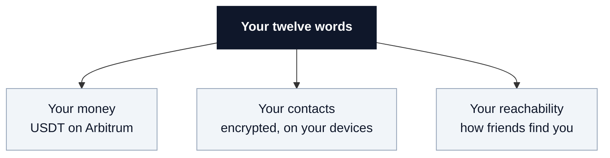
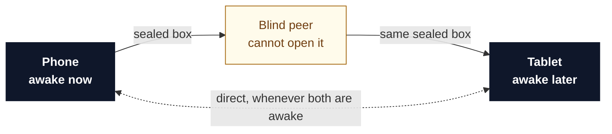

# Moor

**A dollar wallet with no account to be locked out of.**

No signup, no password. Your money, your contacts and your ability to be reached all come
from one twelve-word recovery phrase.


> A learning project and a reference app, not a product. It can hold real money on Arbitrum
> and comes with no warranty. Not affiliated with or endorsed by Tether.

<p align="center">
  
  
  
</p>

<p align="center"><sub>On an iPhone. The gold bar is the dev-seed warning; it never appears in a release build.</sub></p>

---

## What it does

Self custody made the money yours and left everything around it, contacts, device sync,
payment requests, behind an account on somebody's server. Moor puts that half on your own
devices too.

| The usual way | With Moor |
|---|---|
| Sign up with an email and a password | Your twelve words are the account |
| Paste a 42-character address and hope | Tap a name in your contacts |
| Buy a second coin to move your dollars | Pay the fee in the dollars you are sending |
| Your contacts sit on a company server | Your contacts sit on your phone and your tablet |
| Anyone with your address can ask you for money | People you have not added cannot reach you at all |
| A company can close your account | There is no account and no company |

Type the twelve words into a new phone and everything comes back in a few seconds, because
all three are derived from them rather than stored and fetched.



**Contacts live on your devices.** Encrypted with a key from your phrase; the mirror that
carries them between devices cannot read a character.

**You send to a person, not a string.** Pasted addresses are how people lose money.

**Fees are paid in dollars.** No sponsor, no funded account, no bill that could stop being
paid. A self-gas mode pays in ETH if every paymaster on earth refuses you.

**Someone can ask you for money with no server in the middle**, and a stranger cannot: your
phone only accepts connections from people in your contacts. Request spam has no route to
travel down.

**You become reachable by meeting someone**, scanning each other's code once, like Signal's
safety numbers. There is no directory to be listed in.

---

## Two caveats

### 1. We run one machine

Two phones can only talk directly when both are on. So Moor runs a **blind peer**: it holds
sealed boxes and hands them back, never holding a key.



```
a4z9rgfqbqcukuk33gd8z4cwcxijuoxm4eegc6po79rbxsiqpd1o
```

That key is the whole interface, it is the default, and any app on `blind-peering` or
`wdk-p2p-address-book` can use it. Demo infrastructure, no SLA; [`infra/blind-peer/`](infra/blind-peer/)
runs your own in three commands. If it vanishes you lose sync to a device that is switched
off, and nothing else.

The money half also talks to a public Arbitrum RPC, a bundler and a paymaster. All
swappable; none can touch your keys or your contacts.

### 2. USD₮ is issued by a company, and issuers can freeze

Tether operates a blocklist. Holding your own keys means no company can close your account;
it does not mean the issuer gave up the ability to freeze. Moor removes the middlemen it can.

---

## Where it is

| Feature | Status |
|---|---|
| Worklet running both stacks on a phone | iOS and Android |
| USD₮ balance, receive QR | works |
| Contacts, peer to peer, synced across devices | works |
| Payment requests, laptop to phone | iOS |
| QR scan that introduces two people | renders and decodes; camera capture unrun |
| **Sending USD₮, fee paid in USD₮** | **works, on chain, from the app, with no ETH** |
| Payment requests on Android | not yet |
| An account's *first* ever send | blocked upstream, [finding 16](SPEC.md) |

0.1 USD₮ from the app, 0.0088 fee, from an account holding zero wei
([`0xad810dc2…`](https://arbiscan.io/tx/0xad810dc20ff55d2d5cbe3b6dff9475ba2af56cab2e1dada7e52d2e473e4221a8)).
[`lab/t10`](lab/t10-send.js) is the same path in Node.

## How it works

Two stacks in one background runtime on your phone, from one phrase: **WDK** (Tether's
wallet toolkit) moves the money; **Holepunch** (the stack behind Keet) moves everything else.
[`ARCHITECTURE.md`](ARCHITECTURE.md) has the detail.

## Why it exists

Tether's own wallet shipped peer-to-peer contacts in July 2026, almost certainly on the same
library. What did not exist was a version anyone can read, or a mirror to point at. Building
it produced **twenty-four findings** the documentation does not mention and **ten issues
filed** across four WDK repos; the first fix landed upstream on 2026-08-21.
[`upstream/`](upstream/) lists them.

## Try it

```bash
cd lab && npm install && npm run t6      # a second device restores a book from twelve words
```

```bash
cd app && npm install
npx expo prebuild --clean
cd ios && pod install && cd ..           # iOS only
npx expo run:ios                         # or: npx expo run:android
```

No API keys, no `.env` required. Needs Xcode or Android Studio; Expo Go cannot host the
worklet.

## Where things are

| | |
|---|---|
| [`ARCHITECTURE.md`](ARCHITECTURE.md) | One seed, two stacks, one worklet, and what breaks |
| [`SPEC.md`](SPEC.md) | The blueprint, the milestones, and the twenty-four findings |
| [`DESIGN.md`](DESIGN.md) | Why a wallet should look like a bank, not a crypto app |
| [`SECURITY.md`](SECURITY.md) | What is at risk, and how to report something |
| [`app/`](app/) | The wallet. Expo and React Native |
| [`lab/`](lab/) | The harness. Every claim is tested here before it is built |
| [`infra/blind-peer/`](infra/blind-peer/) | The mirror we operate, and how to run your own |
| [`upstream/`](upstream/) | The findings, filed and linked |
| [`docs/flutter-poc.md`](docs/flutter-poc.md) | A Flutter app on WDK's JSON-RPC transport, on Android |

## Licence

[Apache 2.0](LICENSE).
